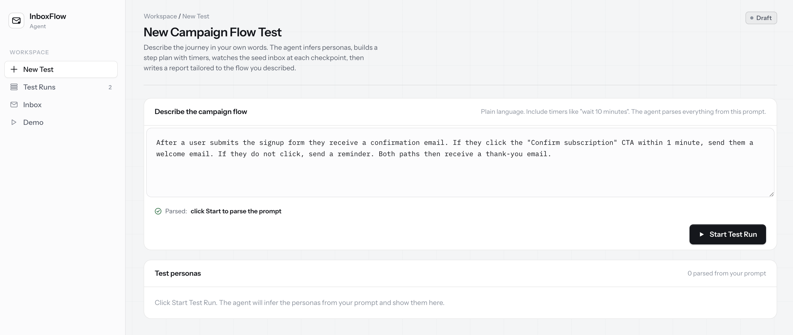
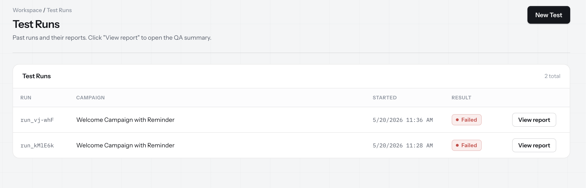
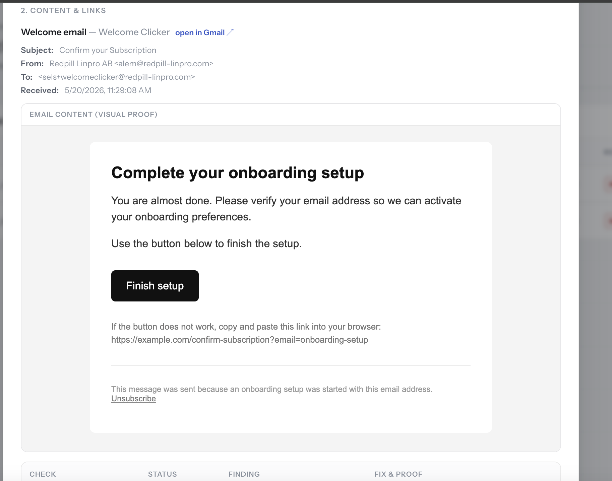
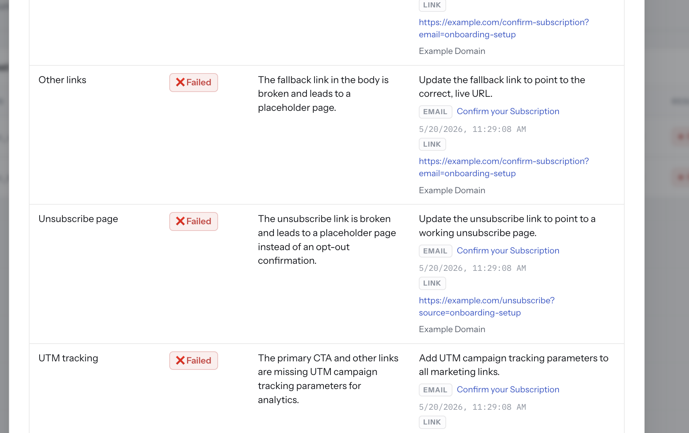

# InboxFlow Agent

Autonomous QA for email marketing journeys. InboxFlow takes a plain-language campaign flow, infers personas and waits, watches a connected Gmail seed inbox, exercises persona behavior, checks landing pages, and produces an evidence-backed launch-readiness report.

## Repository Metadata

**Description:** AI agent for QA testing email marketing flows with Gmail inbox monitoring, persona replay, link/content checks, and launch-readiness reports.

**Suggested topics:** `ai-agent`, `email-qa`, `gmail-api`, `marketing-automation`, `campaign-testing`, `qa-automation`, `react`, `vite`, `express`, `typescript`, `gemini-api`

## Screenshots

**Campaign flow prompt**



**Run history**



**Rendered email proof**



**Content and link findings**



## What It Checks

InboxFlow is built for pre-launch email QA:

- Parses a marketer's journey description into personas, branches, expected email labels, actions, and timed steps.
- Watches Gmail messages addressed to persona aliases such as `+clicker` and `+nonclicker`.
- Classifies each captured email against the expected branch labels.
- Performs persona actions such as clicking the primary CTA or intentionally taking no action.
- Runs deterministic flow validation for missing emails, duplicate sends, and wrong-branch deliveries.
- Scans email content for common machine-detectable risks such as unresolved personalization tokens, missing unsubscribe links, and missing `utm_campaign`.
- Probes landing pages and captures final URL, page title, and visible page text as proof.
- Uses Gemini for semantic checks when configured: placeholder destinations, CTA/content alignment, unsubscribe-page quality, subject fit, and internal/template text leakage.
- Writes a report with campaign readiness, persona replay, flow checks, content/link checks, Gmail deep links, and inline rendered email previews.

## Repository Layout

```text
.
|-- client/                         React + Vite frontend
|   `-- src/
|       |-- App.tsx                 Main UI and run orchestration
|       |-- api.ts                  Browser API client
|       `-- components/             Sidebar, inbox, activity, report modal, run list
|-- server/                         Express + TypeScript backend
|   `-- src/
|       |-- index.ts                Server entrypoint and /api/config
|       |-- routes/                 HTTP routes
|       `-- services/
|           |-- stepRunner.ts       Sequential run executor
|           |-- geminiService.ts    Flow parsing, labeling, QA report reasoning
|           |-- gmailService.ts     OAuth, inbox sync, labels, dedupe filtering
|           |-- flowValidator.ts    Deterministic branch validation
|           |-- linkChecker.ts      Link probes and persona actions
|           `-- store.ts            SQLite and JSON-backed local state
|-- screenshots/                    README screenshots
|-- package.json                    Root scripts for server/client orchestration
`-- .env.example                    Environment variable template
```

Generated build folders and local runtime data are ignored by git.

## Setup

```bash
# Install root, server, and client dependencies.
npm install

# Create an env file if one was not already created by predev.
cp .env.example .env

# Fill in Gmail OAuth values and, ideally, GEMINI_API_KEY.

# Start API and client together.
npm run dev
```

The API listens on `http://localhost:4000`.
The Vite client listens on `http://localhost:5173` unless Vite shifts to another free port.

The root `predev` script copies `.env.example` to `.env` when `.env` is missing. The root `postinstall` script installs both `server/` and `client/` dependencies.

## Scripts

| Command | Description |
| --- | --- |
| `npm run dev` | Run server and client in parallel. The client waits for port `4000`. |
| `npm run dev:server` | Run only the Express API with `tsx watch`. |
| `npm run dev:client` | Run only the Vite client. |
| `npm run build` | Typecheck/build the server, then typecheck/build the client. |
| `npm run start` | Run the built server from `server/dist/index.js`. If `client/dist` exists, the server also serves the frontend. |
| `npm run install:all` | Install root, server, and client dependencies explicitly. |

There is no test script currently; `npm run build` is the main repository verification command.

## Environment Variables

| Variable | Required | Default | Notes |
| --- | --- | --- | --- |
| `PORT` | no | `4000` | Express API port. |
| `SEED_INBOX` | no | connected Gmail address | Optional display/filter label for the seed account. |
| `GEMINI_API_KEY` | recommended | empty | Enables Gemini parsing, classification, semantic flow-fix phrasing, and per-email reasoning. |
| `GEMINI_MODEL` | no | `gemini-2.5-pro` | Used for reasoning-heavy calls. Fast structured calls use `gemini-2.5-flash`. |
| `GOOGLE_CLIENT_ID` | yes | empty | Google OAuth web client id. |
| `GOOGLE_CLIENT_SECRET` | yes | empty | Google OAuth web client secret. |
| `GOOGLE_REDIRECT_URI2` | no | `http://localhost:4000/api/gmail/oauth/callback` | OAuth redirect URI. Must match the Google OAuth client. |
| `CLIENT_URL2` | no | `http://localhost:5173` | Browser URL to redirect to after OAuth completes. |

Gemini is optional but strongly recommended. Without `GEMINI_API_KEY`, flow parsing falls back to deterministic heuristics and the semantic per-email report is reduced.

## New Gmail Account Setup

Use a dedicated seed Gmail or Google Workspace mailbox for QA. This keeps campaign test traffic, labels, and OAuth access separate from a personal inbox.

1. Create or choose the Gmail account that will receive test campaign emails.
2. In Google Cloud, create a project and enable the Gmail API.
3. Configure OAuth consent for the project. For local/private testing, keep the app in testing mode and add the seed Gmail address as a test user.
4. Create OAuth 2.0 credentials with application type `Web application`.
5. Add this authorized redirect URI: `http://localhost:4000/api/gmail/oauth/callback`.
6. Add the Gmail scope used by the app: `https://www.googleapis.com/auth/gmail.modify`.
7. Copy the OAuth client id and client secret into `.env` as `GOOGLE_CLIENT_ID` and `GOOGLE_CLIENT_SECRET`.
8. Optional: set `SEED_INBOX=your-seed-address@gmail.com` so the UI and run records show the mailbox explicitly.
9. Start the app with `npm run dev`.
10. Open `http://localhost:5173`, click Connect, choose the seed Gmail account, and approve access.

Google's OAuth web-server docs explain that web apps need authorized redirect URIs and that localhost redirect URIs are valid for testing: <https://developers.google.com/identity/protocols/oauth2/web-server>.

Google classifies `gmail.modify` as a restricted Gmail scope. For a private/local app, test-user mode is usually enough. For a public production app, expect Google OAuth verification and possibly a restricted-scope security assessment: <https://developers.google.com/workspace/gmail/api/auth/scopes>.

### Switching To Another Gmail Account

If this repo was previously connected to a different Gmail account:

1. Stop the server.
2. Delete `server/data/gmail-tokens.json` if it exists.
3. Start the server again.
4. Click Connect/Reconnect in the sidebar and authorize the new Gmail account.

## Seed Inbox And Aliases

The connected Gmail account is the seed inbox. InboxFlow scans recent Gmail messages and filters them by persona aliases found in recipient headers or snippets.

Persona aliases are inferred from persona ids as `+<id without underscores>` unless Gemini returns an explicit alias. Examples:

- `clicker` -> `+clicker`
- `non_clicker` -> `+nonclicker`
- `welcome_clicker` -> `+welcomeclicker`

For Gmail addresses, plus addressing lets mail sent to `name+clicker@gmail.com` arrive in `name@gmail.com`. Use those aliases in your email platform or campaign test audience so InboxFlow can tell personas apart.

## Run Lifecycle

Every run stores an executable step plan in SQLite. The runner walks it sequentially:

```text
start -> sync -> [wait -> action -> wait -> sync]* -> validate -> report
```

Step behavior:

- `start` records that the test plan was created.
- `sync` queries Gmail, classifies labels, checks safe non-action links, creates/applies the run's Gmail label, and archives captured messages from Inbox.
- `wait` sleeps for the parsed duration in real time.
- `action` records persona behavior. Click actions target only the detected primary CTA and never execute unsubscribe links.
- `validate` runs deterministic branch validation and writes `paths` plus legacy `findings`.
- `report` probes landing pages, runs per-email reasoning when Gemini is available, writes `qaReport`, and sets the canonical run verdict.

The UI can cancel a running job through `POST /api/test-runs/:id/cancel`. Cancellation is cooperative: long waits wake up periodically and stop once the runner sees the cancel flag. Cancelled runs finish with status `cancelled`.

## UI Overview

The client has three sidebar views:

- **New Test** - free-form prompt entry for custom flows.
- **Test Runs** - persisted run list, newest first. Running rows resume the live view; finished rows open the report.
- **Inbox** - recent Gmail Inbox messages with unread count, expandable detail rows, rendered email preview, and Gmail links.

The main run view shows:

- Run status badge: Draft, Running, Failed, or Ready.
- Prompt card.
- Parsed personas with alias and action.
- Collapsible Agent Activity timeline.
- Per-persona path status plus blocker/warning counts.
- Stop button while a run is active.

The report modal shows:

- Header with run id, result, and recommendation.
- Campaign readiness with top fixes and retest requirement.
- Persona replay timeline.
- Flow check table.
- Content & Links table for each captured email.
- Inline sandboxed email preview.
- Open in Gmail, Re-test, and browser `window.print()` PDF export.

Markdown/JSON report export is available through the API. PDF export is intentionally browser print so the rendered email previews are included.

## Storage

Runtime state lives under `server/data/`:

- `inboxflow.sqlite` - SQLite database, auto-created on first use.
- `test_runs` table - indexed run metadata plus a JSON snapshot in `data`.
- `processed_emails` table - cross-run dedupe keyed by campaign, persona alias, and email date so reruns do not double-count older messages.
- `gmail-tokens.json` - OAuth tokens and connected email address.
- `gmail-cache.json` - latest Gmail sync cache.

Legacy `server/data/test-runs.json` files are migrated into SQLite on first boot if the database is empty. After migration the JSON file is renamed to `test-runs.json.migrated`.

The browser stores the active running id in `localStorage` as `inboxflow.activeRunId`, so refreshing the page resumes a live run.

## API Reference

Configuration:

- `GET /api/health` - service heartbeat.
- `GET /api/config` - Gemini model/config state, Gmail connection state, and seed inbox.

Runs:

- `GET /api/test-runs` - list runs newest first.
- `POST /api/test-runs` - create a draft run. Body: `{ "expectedFlowText": "..." }`.
- `GET /api/test-runs/:id` - get the full run snapshot.
- `POST /api/test-runs/:id/start` - start the asynchronous runner. Requires a connected Gmail account.
- `POST /api/test-runs/:id/cancel` - request cooperative cancellation.
- `GET /api/test-runs/:id/events` - get activity timeline events.
- `GET /api/test-runs/:id/report` - get `TestRunReport`.
- `POST /api/test-runs/:id/export?format=json|markdown` - download JSON or Markdown report.
- `POST /api/test-runs/:id/sync-gmail` - manually sync Gmail for an existing run.

Gmail:

- `GET /api/gmail/auth-url` - create an OAuth authorization URL.
- `GET /api/gmail/oauth/callback` - OAuth redirect handler.
- `GET /api/gmail/status` - connection and reauth status.
- `POST /api/gmail/sync` - ad-hoc sync by campaign/personas.
- `GET /api/gmail/inbox` - recent Inbox summary, last 2 days, up to 30 messages.
- `GET /api/gmail/inbox/:id` - full message body for the Inbox detail panel.

Agent:

- `POST /api/agent/parse-flow` - parse a prompt without creating a run.

## Report Shape

Finished runs include a `qaReport`:

```ts
interface QaReport {
  result: 'passed' | 'failed';
  recommendation: 'Ready to launch' | 'Do not launch';
  readiness: {
    decision: 'Ready to launch' | 'Do not launch';
    topFixes: string[];
    retestRequired: boolean;
  };
  replay: PersonaReplay[];
  flowChecks: FlowCheck[];
  emails: EmailContentReport[];
}
```

Each email report carries sanitized HTML for rendering and a stable set of semantic check categories when Gemini reasoning is available:

- Primary CTA link
- CTA button
- Other links
- Unsubscribe
- Unsubscribe page
- Personalization
- UTM tracking
- Subject
- Semantic consistency
- Internal text

Proof objects can cite Gmail messages, links, timestamps, or notes. Gmail proofs use deep links like `https://mail.google.com/mail/u/0/#all/<messageId>`.

## Safety Guardrails

- The LLM never directly executes Gmail actions. Backend code owns side effects.
- Gmail scope is `gmail.modify`, used for read, label creation, label application, and archive-from-Inbox only.
- The agent never sends, deletes, or edits email content.
- Persona click actions target only the detected primary CTA and refuse unsubscribe links.
- Unsubscribe persona actions are recorded, not executed.
- The sync-time link health scan skips primary CTA and unsubscribe links to avoid false engagement and opt-out side effects.
- Report-time page probing fetches link destinations for evidence and semantic analysis. Use care with real campaigns whose non-CTA links are also click-tracked.
- Email previews are stripped of scripts, iframes, objects, embeds, forms, inline event handlers, and `javascript:` URLs before report rendering. Report iframes run without `allow-scripts`.
- Inbox detail previews run in a sandboxed iframe with popups allowed so a user can manually open links in a new tab, but scripts still cannot execute.

## Known Limits

- The runner is in-process. Run snapshots are persisted, but active timers are not replayed after a server crash or restart.
- There is no production job queue, scheduler, or multi-worker locking.
- There is no multi-tenant account model, RBAC, billing, or production OAuth verification.
- Only Gmail is implemented as the inbox provider.
- Marketo, Klaviyo, Braze, Salesforce Marketing Cloud, and other ESP integrations are not implemented.
- Form-fill automation is intentionally out of scope.
